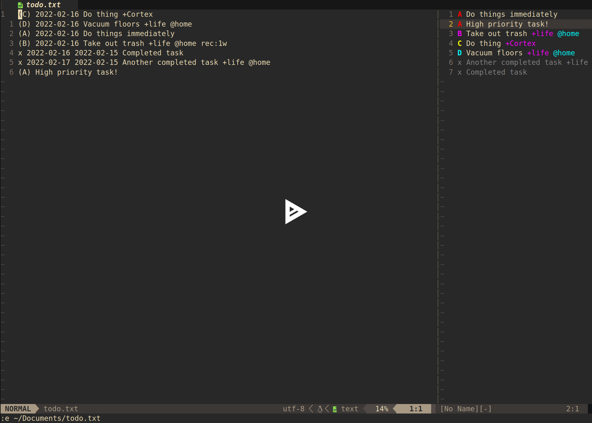
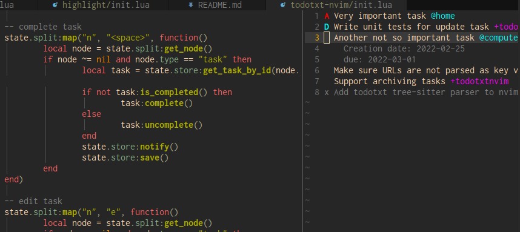
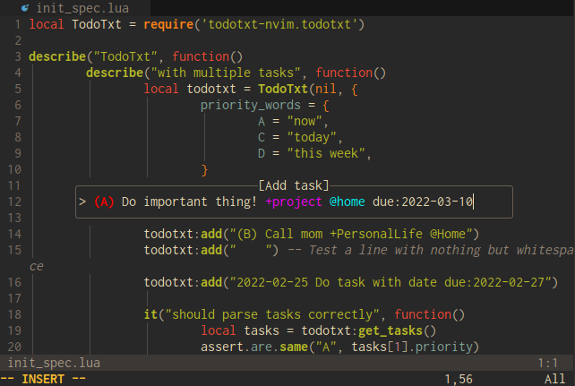

# todotxt.nvim

Neovim plugin to view and add tasks stored in a todo.txt format.

[](https://asciinema.org/a/DVMyXY3pvUBKNdzu5Ywy9jweE)

## Features

### Sidebar split

Sidebar split to view and manage tasks.



### Prompt

Prompt to quickly add new tasks.



## Requirements

- Neovim 0.5.0
- [nui.nvim](https://github.com/MunifTanjim/nui.nvim)

## Installation

With [packer.nvim](https://github.com/wbthomason/packer.nvim):
```lua
use {
	'arnarg/todotxt.nvim',
	requires = {'MunifTanjim/nui.nvim'},
}
```

## Quickstart

Add the `setup()` function to your init file.

For `init.lua`:
```lua
require('todotxt-nvim').setup({
	todo_file = "/path/to/todo.txt",
})
```

For `init.vim`:
```vim
lua <<EOF
require('todotxt-nvim').setup({
	todo_file = "/path/to/todo.txt",
})
EOF
```

## Configuration

```lua
{
	todo_file = "/path/to/todo.txt",
	sidebar = {
		width = 40,
		position = "left" | "right" | "bottom" | "top", -- default: "right"
	},
	capture = {
		prompt = "> ",
		-- Percentage is percentage of width of the whole editor
		-- Integer is number of columns
		width = "75%" | 50,
		position = "50%",
		-- Styled after https://swiftodoapp.com/todotxt-syntax/priority/
		-- With this, if you include any of the below keywords it will
		-- automatically use the associated priority and remove that
		-- keyword from the final task.
		alternative_priority = {
			A = "now",
			B = "next",
			C = "today",
			D = "this week",
			E = "next week",
		},
	},
	-- Highlights used in both capture prompt and tasks sidebar
	highlights = {
		project = {
			fg = "magenta",
			bg = "NONE",
			style = "NONE",
		},
		context = {
			fg = "cyan",
			bg = "NONE",
			style = "NONE",
		},
		date = {
			fg = "NONE",
			bg = "NONE",
			style = "underline",
		},
		priorities = {
			A = {
				fg = "red",
				bg = "NONE",
				style = "bold",
			},
			B = {
				fg = "magenta",
				bg = "NONE",
				style = "bold",
			},
			C = {
				fg = "yellow",
				bg = "NONE",
				style = "bold",
			},
			D = {
				fg = "cyan",
				bg = "NONE",
				style = "bold",
			},
		},
	},
	-- Keymap used in sidebar split
	keymap = {
		quit = "q",
		toggle_metadata = "m",
		delete_task = "dd",
		complete_task = "<space>",
		edit_task = "ee",
	},
}
```

## Usage

### Commands

`:ToDoTxtCapture`: Opens up a prompt to add a new task.

`:ToDoTasksToggle`: Opens up a sidebar split with tasks parsed from todo.txt file provided to `setup()`. There is also `:ToDoTasksOpen` and `:ToDoTasksClose` available.

### Keymap in sidebar split

| Keymap    | Action                                     |
|-----------|--------------------------------------------|
| `e`       | Edit task under cursor                     |
| `dd`      | Delete task under cursor                   |
| `<space>` | Toggles task under cursor as done/not done |
| `m`       | Toggle metadata for task                   |
| `q`       | Close sidebar pane                         |
